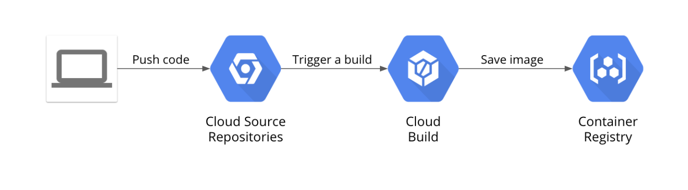

# Building a DevOps Pipeline

[https://www.cloudskillsboost.google](https://www.cloudskillsboost.google)

[Select - DevOps Engineer, SRE Learning Path](https://www.cloudskillsboost.google/paths)


## Objectives



- Create a Git repository
- Create a simple Python application
- Test Your web application in Cloud Shell
- Define a Docker build
- Manage Docker images with Cloud Build and Container Registry
- Automate builds with triggers
- Test your build changes


### Create a Git repository

- Use service `Source Repositories`
- Name : `devops-repo`
- Create
- Activate CloudShell
- Clone the repo

```bash
mkdir gcp-course
cd gcp-course
gcloud source repos clone devops-repo
cd devops-repo
```

### Create a simple Python application

