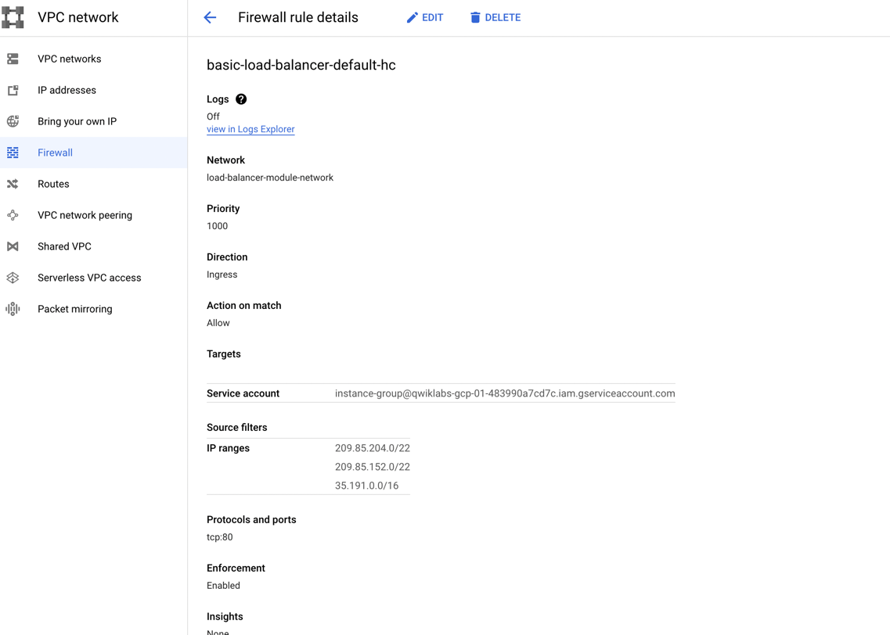

# Modular Load Balancing with Terraform - Regional Load Bala

[https://www.cloudskillsboost.google](https://www.cloudskillsboost.google)

[Select - Quest -  Managing Cloud Infrastructure with Terraform](https://www.cloudskillsboost.google/paths)

[community/tutorials/modular-load-balancing-with-terraform](https://cloud.google.com/community/tutorials/modular-load-balancing-with-terraform)

**High Level Objectives**
- Use load balancing modules for Terraform
- Create a regional TCP load balancer
- Create a regional internal TCP load balancer
- Create a global HTTP load balancer with Kubernetes Engine

**Skills**
- here

**Version Stack**

| Stack     | Version |
|-----------|---------|
| Terraform | 1.3.9   |

## Clone the examples repository

```bash
git clone https://github.com/GoogleCloudPlatform/terraform-google-lb
cd ~/terraform-google-lb/examples/basic
```


## TCP load balancer with regional forwarding rule

```bash
export GOOGLE_PROJECT=$(gcloud config get-value project)

terraform init

terraform plan

terraform apply


EXTERNAL_IP=$(terraform output | grep load_balancer_default_ip | cut -d = -f2 | xargs echo -n)


echo "http://${EXTERNAL_IP}"
```

## Screenshots

- Forwarding rules
  - In GCP, a forwarding rule is a configuration that specifies how traffic should be directed to a load balancer. 
    It is a key component of GCP's load balancing service, which distributes incoming traffic to a group of backend instances.
  - A forwarding rule specifies the IP address, protocol, and ports that the load balancer should listen on. 
    It also defines the target pool, which is a group of backend instances that the load balancer will direct traffic to. 
  - There are different types of forwarding rules in GCP, including regional forwarding rules, global forwarding rules, 
    and target forwarding rules. Each type is used for different load balancing scenarios, and each has its own set of configuration options.


- Target Pools
  - In Google Cloud Platform (GCP), a target pool is a group of virtual machine (VM) instances or internet protocol (IP) addresses that receive incoming 
    traffic from a Google Cloud load balancer. The target pool defines the set of virtual machines or IP addresses that should receive traffic, and the 
    load balancer routes traffic to the instances in the pool based on the load balancing algorithm configured for the load balancer. 
  - Target pools provide a way to distribute traffic across multiple instances of a service, which can help improve availability and scalability. 
    By grouping instances or IP addresses into a target pool, GCP can direct traffic to available instances, and take instances out of rotation as needed, 
    based on health checks or other configurable criteria.


- Health checks
  - Health checks in GCP are used to monitor the health and availability of instances or endpoints. 
    A health check sends requests to an instance or endpoint and analyzes the response to determine whether the instance or endpoint is healthy or not. 
  - In GCP, there are several types of health checks available, such as HTTP, HTTPS, TCP, and SSL health checks. 
    These health checks can be used to monitor instances running on Compute Engine, instances running on Kubernetes Engine, or endpoints 
    running on App Engine, Cloud Functions, or Cloud Run. 
  - By using health checks, you can configure load balancers to automatically remove unhealthy instances from a load-balancing pool 
    and redirect traffic to healthy instances. This helps to ensure that your applications are always available to users, even 
    if some instances or endpoints fail.





