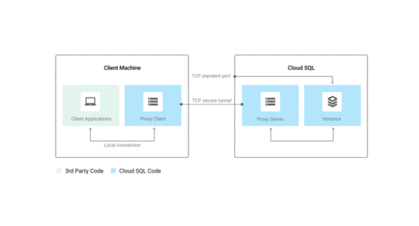

# Cloud SQL with Terraform


[https://www.cloudskillsboost.google](https://www.cloudskillsboost.google)

[Select - Quest -  Managing Cloud Infrastructure with Terraform](https://www.cloudskillsboost.google/paths)


**High Level Objectives**
- Understand the code
- Run Terraform
- Install Cloud SQL Proxy
- Test connection to the database


**Skills**
- terraform
- cloud sql
- cloud sql proxy


**Version Stack**

| Stack     | Version |
|-----------|---------|
| Terraform | 1.3.9   |


## Download necessary files


```bash
mkdir sql-with-terraform
cd sql-with-terraform
gsutil cp -r gs://spls/gsp234/gsp234.zip .

# Unzip the downloaded content:
unzip gsp234.zip
```

## Understand the code


## Run Terraform

```bash
terraform init


terraform plan -out=tfplan


terraform apply tfplan
```

## Cloud SQL Proxy

- The Cloud SQL Proxy provides secure access to your Cloud SQL Second Generation instances 
  without having to allowlist IP addresses or configure SSL.

- The Cloud SQL Proxy works by having a local client, called the proxy, running in the local environment. 
  Your application communicates with the proxy with the standard protocol used by your database. 
  The proxy uses a secure tunnel to communicate with its companion process running on the server.





## Installing the Cloud SQL Proxy


```bash
wget https://dl.google.com/cloudsql/cloud_sql_proxy.linux.amd64 -O cloud_sql_proxy

chmod +x cloud_sql_proxy


```


## Test connection to the database

```bash
# Start by running the Cloud SQL proxy for the Cloud SQL instance:
export GOOGLE_PROJECT=$(gcloud config get-value project)

MYSQL_DB_NAME=$(terraform output -json | jq -r '.instance_name.value')
MYSQL_CONN_NAME="${GOOGLE_PROJECT}:us-central1:${MYSQL_DB_NAME}"

# Run the following command:
./cloud_sql_proxy -instances=${MYSQL_CONN_NAME}=tcp:3306

# Now you'll start another Cloud Shell tab by clicking on plus (+) icon. You'll use this shell to connect to the Cloud SQL proxy.
# Navigate to sql-with-terraform directory:
cd ~/sql-with-terraform

# Get the generated password for MYSQL:
echo MYSQL_PASSWORD=$(terraform output -json | jq -r '.generated_user_password.value')

# Test the MySQL connection:
mysql -udefault -p --host 127.0.0.1 default

# When prompted, enter the value of MYSQL_PASSWORD, found in the output above, and press Enter.

# You should successfully log into the MYSQL command line. Exit from MYSQL by typing Ctrl + D.


mysql> show databases;
+--------------------+
| Database           |
+--------------------+
| information_schema |
| default            |
| mysql              |
| performance_schema |
+--------------------+
4 rows in set (0.10 sec)
```