- aws compute
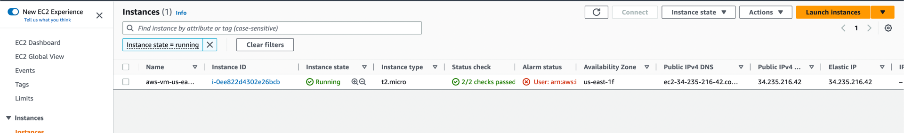

- aws vpc

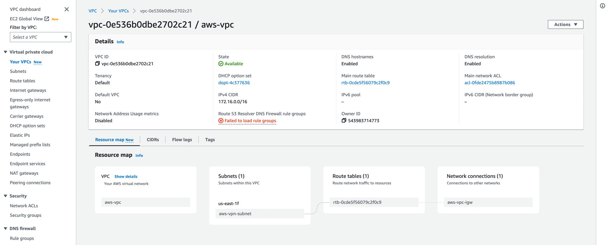

- aws subnets

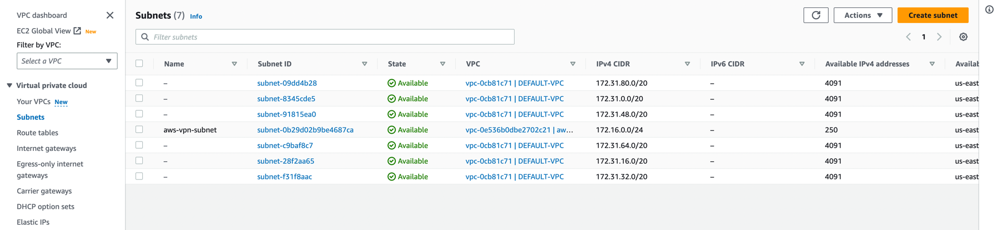

- aws internet gateway

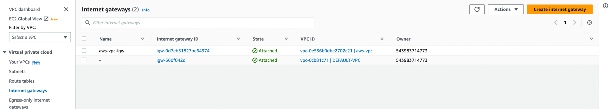

- aws vpn connections

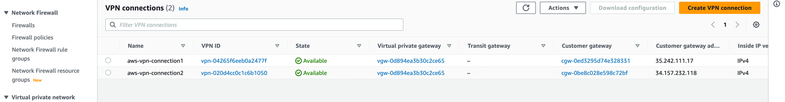

- aws customer gateways

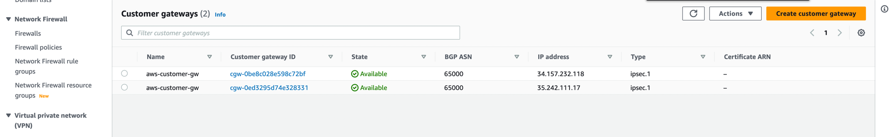

- aws virtual private gateways

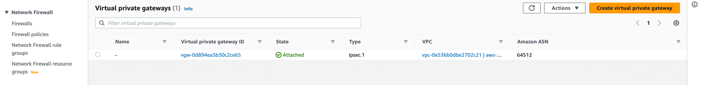

- gcp compute

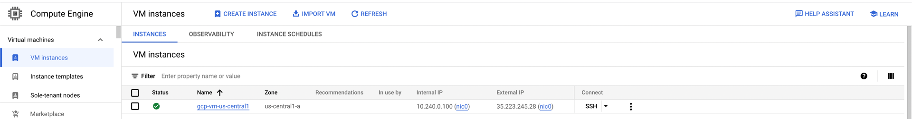

- gcp network

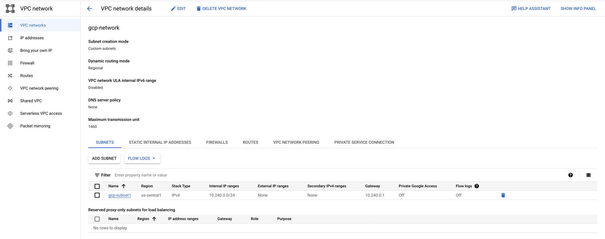

- gcp peer vpn gateways

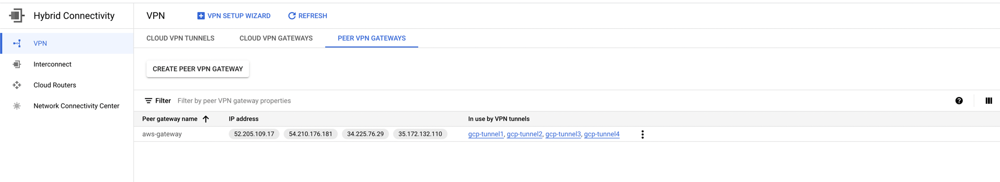

- gcp cloud vpn gateway

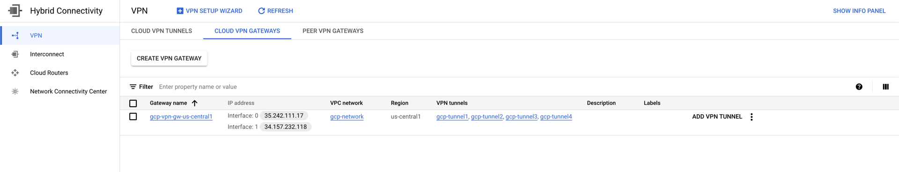

- gcp cloud vpn tunnels

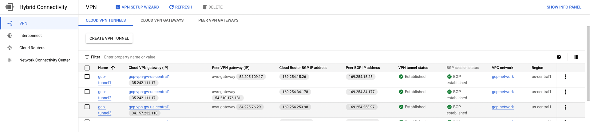

- gcp cloud router

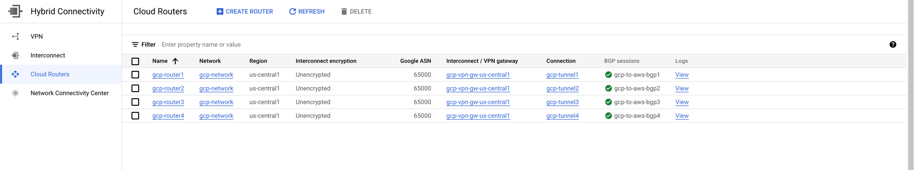

- gcp cloud router details

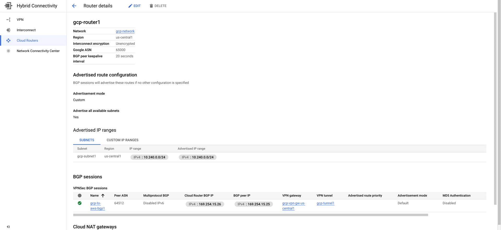

- gcp cloud firewall

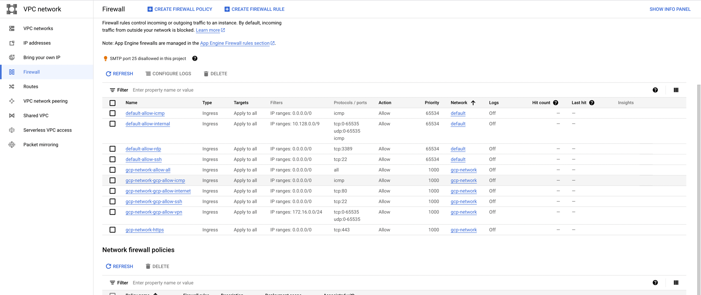

- gcp cloud routes

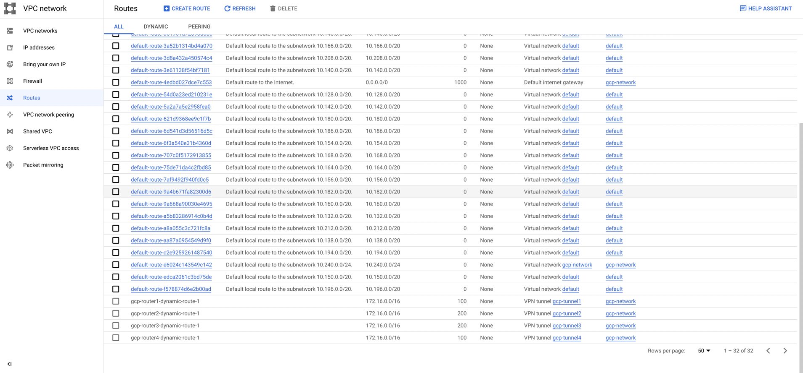

- gcp cloud IP addresses

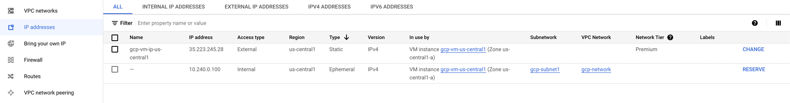